[](https://classroom.github.com/open-in-codespaces?assignment_repo_id=21828359)

# Python Flask CI/CD Lab Application

This is a Python Flask web application designed for learning CI/CD (Continuous Integration/Continuous Deployment) concepts with GitHub Actions.

## Getting Started

### Prerequisites

- Python 3.12 or higher
- pip (Python package manager)

### Installation

1. Clone the repository:
   ```bash
   git clone <repository-url>
   cd w10-lab-ai-cicd-tomaspettit2506
   ```

2. Install the required dependencies:
   ```bash
   pip install -r requirements.txt
   ```

### Running the Application

Start the Flask development server:
```bash
python3 -m flask --app startup run
```

The application will be available at `http://127.0.0.1:5000/`.

### Running the Tests

Run the test suite using pytest:
```bash
python -m pytest
```

---

# Lab: AI-Powered CI/CD with GitHub Actions

## 🚀 Introduction

Continuous Integration (CI) is the practice of automating the build and testing of your code every time a change is made. Traditionally, writing CI pipelines required memorising complex YAML syntax and obscure shell commands.

In this lab, you will use **GitHub Copilot** to:

1.  **Generate** a complete CI/CD pipeline from scratch using Agent Mode.
2.  **Script** complex automation tasks using natural language in the terminal.
3.  **Debug** and fix broken builds using AI assistance.
4.  **Embed** AI directly into your workflow to automate issue management.
5.  **Delegate** coding tasks to an AI Agent and get automated Code Reviews.

-----

## Agenda

1.  [**Part 1:** Explore the App](#part-1-explore-the-app)
2.  [**Part 2:** Generative CI/CD](#part-2-generative-cicd)
3.  [**Part 3:** Pipeline Updates](#part-3-pipeline-updates)
4.  [**Part 4:** The "Fix It" Loop](#part-4-the-fix-it-loop)
5.  [**Part 5:** Advanced - Security & Autofix](#part-5-advanced---security--autofix)
6.  [**Part 6:** Extension - AI Engineering in CI/CD](#part-6-extension---ai-engineering-in-cicd)
7.  [**Part 7:** The AI Teammate (Issues & PRs)](#part-7-the-ai-teammate-issues--prs)


## 🏗️ Architecture

We are building a standard Python "Lint & Test" pipeline.

```mermaid
flowchart LR
    subgraph "Developer Environment"
        A[💻 Student Code]
        AI[🤖 Copilot Agent]
    end

    subgraph "GitHub Cloud"
        R[📂 Repository]
        W[⚙️ Actions Workflow]
        PR[👀 AI Code Review]
    end

    subgraph "CI Pipeline Runner"
        S1[📦 Install Deps pip]
        S2[✨ Lint Flake8 Ruff]
        S3[🧪 Test pytest]
        S4[🧠 AI Inference]
    end

    A -- "Pushes Code" --> R
    AI -- "Creates Files" --> A
    R -- "Triggers" --> W
    W --> S1 --> S2 --> S3
    W -.-> S4
    R -- "Pull Request" --> PR
```



-----


## Part 1: Explore the App

Before we build the pipeline, let's verify the application works.

1.  **Run the App**: Open the terminal and run the following command:
    ```bash
    python3 -m flask --app startup run
    ```
2.  **View the App**:
    *   You should see a notification in the bottom right saying "Your application running on port 5000 is available."
    *   Click **Open in Browser**.
    *   Click around the links (Home, About, Contact) to see the simple Flask app.
3.  **Stop the App**:
    *   Go back to the terminal.
    *   Press `Ctrl+C` to stop the server.

-----

## Part 2: Generative CI/CD

*Goal: Use Copilot Agent Mode to generate the pipeline files automatically.*

Instead of writing YAML manually or copy-pasting, we will ask the AI Agent to create the file for us.

### Step 1: The Agent Prompt

1.  Open **Copilot Chat** **Agent** mode.

2.  Enter the following prompt. Be specific about the filename and requirements!  
**Prompt:**  

    > Create a GitHub Actions workflow file named python-app.yml. It should run on push to the 'main' branch. It needs to use Python 3.12, install dependencies from requirements.txt, run flake8 for linting, and run tests using `python -m pytest` to avoid import errors. Name the workflow 'Python CI'.

3.  **Review the Plan:** The Agent will analyse your workspace and propose creating a new file path: `.github/workflows/python-app.yml`.

4.  **Accept the Changes:** Click **Keep** (or the checkmark icon) to confirm. The AI will create the folder structure and the file instantly.

### Step 2: Commit and Run

1.  Open the **Source Control** tab (left side).
2.  Stage, Commit ("Add CI pipeline"), and Sync Changes.
3.  Go to your repository on **GitHub.com** (leave the Codespace open).
4.  Click the **Actions** tab.
5.  You should see your "Python CI" workflow running! 🟢

-----

## Part 3: Pipeline Updates

*Goal: Use Copilot to write shell scripts without knowing the syntax.*

Often, CI pipelines need to do "scripty" things, like verifying specific package versions. This is usually hard to remember.

### Step 1: The "How do I..." Challenge

We want to add a step to our pipeline that prints the version of Flask currently installed.

1.  Ask Copilot for the command:  
**Prompt**  

    > Write a bash command to grep the Flask version from pip freeze

2.  Copilot will offer a command (likely `pip show Flask` or `pip freeze | grep Flask`). Select **Copy to clipboard**.

### Step 2: Update the Workflow

1.  Ask Copilot to:

> Add a step to the build job that prints the Flask version

2.  Commit and push.
3.  Watch the Action run on GitHub. Expand the "Check Flask Version" step in the logs to see if it worked.

-----

## Part 4: The "Fix It" Loop

*Goal: Simulate a failure and use AI to diagnose it.*

A CI pipeline is useless if you can't fix it when it breaks.

### Step 1: Break the Code

1.  Open the test file (`tests/test_app.py`).
      * *Use Copilot Agent: "Create a simple failing test for a flask app named tests/test_fail.py"*
2.  Add a failing assertion:
    ```python
    def test_math_fail():
        assert 1 + 1 == 3
    ```
3.  Commit and Push: "Breaking the build".

### Step 2: Analyse with Copilot

1.  Go to the **Actions** tab on GitHub.
2.  Click the failed run 🔴.
3.  Click the **build** job and scroll to the red error lines.
4.  **Highlight the error log** directly in the browser (or copy it).
5.  Go back to VS Code / Codespaces.
6.  Paste the error into Copilot Chat and ask:
    > **Prompt:** "Here is a pytest error from my CI logs. Explain why it failed and point me to the file I need to fix."

### Step 3: The Fix

1.  Copilot should identify that `test_math_fail` failed.
2.  Navigate to that file.
3.  Highlight the broken code and ask Copilot: "Fix this test so it passes."
4.  Accept the fix, commit, and push.
5.  Verify the pipeline turns green 🟢.

-----

## Part 5: Advanced - Security & Autofix

*Goal: Use AI to find security vulnerabilities.*

If your repository is public (or you have GitHub Advanced Security), you can enable **CodeQL**.

1.  In the **Actions** tab, click **New workflow**.
2.  Search for "CodeQL Analysis".
3.  Copilot can explain what this file does.
    > **Prompt:** "Explain what the 'Analyse' step does in this CodeQL workflow."
4.  Commit this workflow. It will scan your code for vulnerabilities.
5.  **Simulate a Vulnerability:** Add a hardcoded secret to your python file:
    ```python
    # In hello_app/webapp.py
    AWS_SECRET_KEY = "AKIA1234567890"
    ```
6.  When CodeQL runs, it will alert you in the **Security** tab.
7.  **Autofix:** Look for the **"Copilot Autofix"** button (if available) to have AI rewrite the code securely automatically (e.g., by suggesting you use an environment variable).

-----

## Part 6: Extension - AI Engineering in CI/CD

*Goal: Use the `ai-inference` action to "think" inside your pipeline.*

We will create a workflow that uses an LLM to automatically categorise new Issues opened in your repository.

### Step 1: The "Triage" Workflow

1.  Open **Copilot Edits / Agent Mode** (`Ctrl+Shift+I`).

2.  Enter the prompt:

    > **Prompt:** "Create a new GitHub Action workflow file named ai-triage.yml. It should trigger when an issue is opened. It should use the 'actions/ai-inference@v1' action to analyse the issue title and body, determining if it is a Bug, Feature, or Question. Print the result to the logs."

3.  **Refine the Code:** If needed, paste this YAML configuration:

    ```yaml
    name: AI Issue Triage
    on:
      issues:
        types: [opened]

    jobs:
      triage:
        runs-on: ubuntu-latest
        permissions:
          issues: write
        steps:
          - name: Check Issue Context
            run: echo "New issue opened: ${{ github.event.issue.title }}"

          - name: AI Classification
            uses: actions/ai-inference@v1
            id: classify
            with:
              model: 'gpt-4o-mini' 
              prompt: |
                Analyse this issue:
                Title: ${{ github.event.issue.title }}
                Body: ${{ github.event.issue.body }}
                
                Is this a 'Bug', 'Feature', or 'Question'? Respond with only one word.
            env:
              GITHUB_TOKEN: ${{ secrets.GITHUB_TOKEN }}
          
          - name: Print Classification
            run: echo "The AI thinks this is a ${{ steps.classify.outputs.response }}"
    ```

4.  Commit and test by creating a new issue.

-----

## Part 7: The AI Teammate (Issues & PRs)

*Goal: Delegate tasks to Copilot and get automated code reviews.*

In this section, we will treat Copilot not just as a chat bot, but as an agent that can perform work on its own.

### Step 1: Assign an Issue to Copilot

1.  Go to the **Issues** tab on GitHub.
2.  Click **New Issue**.
3.  **Title:** "Create a README file"
4.  **Description:** "Please add a README.md file to the repository. It should explain that this is a Python Flask app for a CI/CD lab. Include instructions on how to install requirements and run the tests."
5.  **Submit** the issue.
6.  **Assign it:** Look at the right-hand sidebar. Click **Assignees** and select **Copilot** (or type `@copilot` in a comment).
7.  **Watch the Magic:**
      * Refresh the page after 10-20 seconds.
      * Copilot will comment with a plan.
      * Copilot will automatically open a **Pull Request** with the code written!

### Step 2: Automated Copilot Review

Now, let's see if Copilot can critique *our* code.

1.  Go back to VS Code (Codespaces).
2.  Create a new branch: `git checkout -b bad-code-branch`.
3.  Add some "questionable" code to `hello_app/webapp.py` (or any python file):
    ```python
    # Adding a debug print that shouldn't be in production
    def potentially_slow_function():
        print("DEBUG: Starting function...") 
        import time
        time.sleep(1) # Hardcoded delay
        return True
    ```
4.  Commit and Push:
    ```bash
    git add .
    git commit -m "Add feature with debug logs"
    git push origin bad-code-branch
    ```
5.  Go to GitHub and **Open a Pull Request**.
6.  **Request a Review:**
      * On the PR page, look at the **Reviewers** sidebar on the right.
      * Click the gear icon and select **Copilot**.
      * *(Note: If you don't see Copilot in the list, ensure you have a paid Copilot seat or Student Pack active).*
7.  **Read the Review:** Copilot will analyse your diff and post comments about the `print` statement (suggesting logging instead) and the `time.sleep` (performance warning).

-----

## 📝 Summary Checklist

  - [ ] Created a workflow using **Copilot Agent Mode**.
  - [ ] Used `Copilot` to write a shell script step.
  - [ ] Diagnosed a CI log error using Copilot Chat.
  - [ ] Assigned a GitHub Issue to `@copilot` and merged the resulting PR.
  - [ ] Received an automated Code Review from Copilot on a Pull Request.

-----